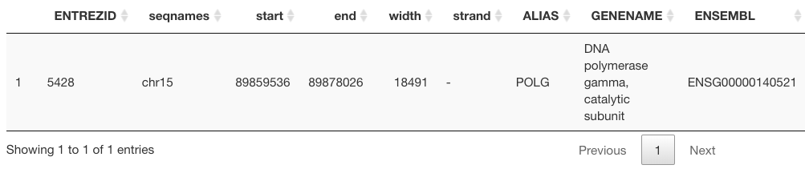

```{r warning=FALSE, error=F}
knitr::opts_chunk$set(
  collapse = TRUE,
  comment = "#>"
)
```

# Introduction


This is a package containing unCOVERApp,  a shiny graphical application for 
clinical assessment of sequence coverage. 
unCOVERApp allows:


- to display interactive plots showing sequence gene coverage down to base-pair
resolution and functional/ clinical annotations of sequence 
positions within coverage gaps (` Coverage Analysis` page).


- to calculate the [maximum credible population allele frequency](http://cardiodb.org/allelefrequencyapp/) (AF) to be applied as AF 
filtering threshold tailored to the model of the disease-of-interest 
instead of a general AF cut-off (e.g. 1 % or 0.1 %) 
(` Calculate AF by allele frequency app ` page).


- to calculate the 95 % probability of the binomial distribution to observe at 
least N variant-supporting reads (N is the number of successes) based on a 
user-defined allele fraction that is expected for the variant 
(which is the probability of success). Especially useful to obtain the 
range of variant-supporting reads that is most likely to occur at a given 
a depth of coverage (DoC)(which is the number of trials) for somatic variants with low allele fraction
(` Binomial distribution`page). 


# Installation and example

Install the latest version of `uncoverappLib` using `BiocManager`. 

`uncoverappLib` requires:

- R version >= 4.1.2
- java installed
- Annotation files for clinical assessment of low-coverage positions. 


```{r  eval=F, echo=T}

#install.packages("BiocManager")
#BiocManager::install("uncoverappLib")
library(uncoverappLib)
```


Alternatively, it can be installed from GitHub using:


```{r eval=F, echo=T}

library(devtools)
#install_github("Manuelaio/uncoverappLib")
#library(uncoverappLib)

```

When users load `uncoverappLib` for the first time, the first thing to do is a
download of annotation files. 
`getAnnotationFiles()` function allows to download the annotation files from [Zenodo](https://zenodo.org/record/3747448#.XpBmnVMzbOR) and parse it using 
uncoverappLib package. The function does not return an R object but store the
annotation files in a cache (`sorted.bed.gz` and `sorted.bed.gz.tbi`) and show  
the cache path. 
The local cache is managed by the `BiocFileCache` **Bioconductor** package.
It is sufficient run the function `getAnnotationFiles(verbose= TRUE)` one time 
after installing *uncoverappLib* package as shown below. The preprocessing time 
can take few minutes, therefore during running vignette, users can provide `vignette= TRUE`
as a parameter to download an example annotation files, as below. 

```{r eval=TRUE, echo=TRUE}
library(uncoverappLib)
#getAnnotationFiles(verbose= TRUE, vignette= TRUE)

```


The preprocessing time can take few minutes. 

# Input file

All unCOVERApp functionalities are based on the availability of a BED-style 
formatted input file containing tab-separated specifications of genomic 
coordinates (chromosome, start position, end position), the coverage value, 
and the reference:alternate allele counts for each position. In the first 
page **Preprocessing**, users can prepare the input file by specifying the genes 
to be examined and the BAM file(s) to be inspected. Users should be able to 
provide:


- a text file, with .txt extension, containing HGNC official gene name(s) one per 
row and to be uploaded to ` Load input file ` box. An example file is
included in extdata of uncoverappLib packages

```{r eval=TRUE, echo=TRUE}
gene.list<- system.file("extdata", "mygene.txt", package = "uncoverappLib")

```

- a text file, with .list extension, containing absolute paths to BAM files
(one per row) and to be uploaded to ` Load bam file(s) list ` box.

Type the following command to load our example: 


```{r eval=TRUE, echo=TRUE}

bam_example <- system.file("extdata", "example_POLG.bam", package = "uncoverappLib")

print(bam_example)

write.table(bam_example, file= "./bam.list", quote= FALSE, row.names = FALSE, 
            col.names = FALSE)

```

and launch ` run.uncoverapp(where="browser") `  command. After running `run.uncoverapp(where="browser")` 
the shiny app appears in your deafult browser. RStudio user can define where 
launching uncoverapp  using `where` option:

 - `browser` option will open `uncoverapp` in your default browser
 - `panel` option will open `uncoverapp` in RStudio viewer
 - `window` option will open `uncoverapp` in RStudio RStudio

If option `where` is not defined uncoverapp will launch with default option of R. 

In the first page **Preprocessing** users can load `mygene.txt` in 
` Load input file ` and `bam.list` in ` Load bam file(s) list `. 
In general, a target bed can also be used instead of genes name 
selecting `Target Bed` option in `Choose the type of your input file`. 
Users should also specify the reference genome in `Genome` box and the chromosome 
notation of their BAM file(s) in `Chromosome Notation` box. In the BAM file, 
the number option refers to 1, 2, ..., X,.M chromosome notation, while the chr 
option refers to chr1, chr2, ... chrX, chrM chromosome notation. 
Users can specify the `minimum mapping quality (MAPQ) ` value in box and 
`minimum base quality (QUAL)` value in box. 
Default values for both mapping and 
base qualities is 1. Users can download `Statistical_Summary` report 
to obtain a coverage metrics per genes 
(`List of genes name`) or per amplicons (`Target Bed`) according to uploaded input 
file. 
The report summarizes following information: mean, median,
number of positions under 20x and percentage of position above 20x. 

To run the example, choose *chr* chromosome notation, 
*hg19* genome reference and leave minimum mapping and base qualities to the 
default settings, as shown in the following screenshot of the Preprocessing page:


```{r, echo = FALSE, out.width='80%', fig.align='center', fig.cap="Screenshot of Preprocessing page."}


```


unCOVERApp input file generation fails if incorrect gene names are specified. 
An unrecognized gene name(s) table is displayed if such a case occurs.
Below is a snippet of a the unCOVERApp input file generated as a result of
the **preprocessing** step performed for the example


```{r eval=FALSE, echo=TRUE}

chr15   89859516        89859516        68      A:68
chr15   89859517        89859517        70      T:70
chr15   89859518        89859518        73      A:2;G:71
chr15   89859519        89859519        73      A:73
chr15   89859520        89859520        74      C:74
chr15   89859521        89859521        75      C:1;T:74

```


The preprocessing time depends on the size of the BAM file(s) and on the number 
of genes to investigate. In general, if many (e.g. > 50) genes are to be analyzed, 
we would recommend to use `buildInput` function  
in R console before launching  the app as shown in following example. This function
also return a file with .txt estention containg statistical report of each genes/amplicon 

```{r eval=TRUE, echo=TRUE}
library(dplyr)

gene.list<- system.file("extdata", "mygene.txt", package = "uncoverappLib")

bam_example <- system.file("extdata", "example_POLG.bam", package = "uncoverappLib")
cat(bam_example, file = "bam.list", sep = "\n")
temp_dir=tempdir()
buildInput(geneList= gene.list, genome= "hg19", type_bam= "chr", type_input = "genes",bamList= "bam.list", outDir= temp_dir)

```

Alternatively, other tools do a similar job and can be used to generate the 
unCOVERApp input file ( for instance:
[bedtools](https://bedtools.readthedocs.io/en/latest/#), 
[samtools](http://www.htslib.org/doc/samtools-depth.html), 
[gatk](https://gatk.broadinstitute.org/hc/en-us)). 
In this case, users can load the file directly on
**Coverage Analysis**  page in `Select input file` box. 


Once pre-processing is done, users can move to the **Coverage Analysis** page 
and push the `load prepared input file` button.


```{r, echo = FALSE, out.width='100%', fig.align='center', fig.cap="Screenshot of Coverage Analysis page."}
knitr::include_graphics("load_file.png")

```


To assess sequence coverage of the example, the following input parameters must 
be specified in the sidebar of the **Coverage Analysis** section


- ` Reference Genome` : reference genome (hg19 or hg38); choose hg19

- ` Gene name ` and push ` Apply ` button:  write the HGNC official gene name *POLG* 

- ` Coverage threshold ` : specify coverage threshold (e.g. 20x)

- ` Sample` : sample name to be analyzed

- ` Transcript number ` : transcript number. Choose 1

- ` exon number `: to zoom in a specific exon. Choose 10


Other input sections, as ` Chromosome `, ` Transcript ID `, ` START genomic position `, 
` END genomic position ` and ` Region coordinate `, are dynamically filled. 


# Output

unCOVERApp generates the following **outputs** : 


- unfiltered BED file in ` bed file ` and the corresponding filtered dataset in
` Low-coverage positions ` 

- information about POLG gene in ` UCSC gene ` table


```{r, echo = FALSE, out.width='100%', fig.align='center', fig.cap="Screenshot of output of UCSC gene table."}


```


- information about POLG exons in 
` UCSC exons` table


```{r, echo = FALSE, out.width='100%', fig.align='center', fig.cap="Screenshot of output of Exon genomic coordinate positions from UCSC table."}


```


- sequence gene coverage plot in ` Gene coverage`  . The plot displays the 
chromosome ideogram, the genomic location and gene annotations from **Ensembl** 
and the transcript(s) annotation from UCSC. Processing time is few minutes. A 
related table shows the number of uncovered positions in each exon given a 
user-defined transcript number (here transcript number is 1), and the 
user-defined threshold coverage (here the coverage threshold is 20x). 
Table and plot both show the many genomic positions that display low-DoC profile
in POLG.


```{r, echo = FALSE, out.width='100%', fig.align='center', fig.cap="Screenshot of output of gene coverage."}


```


- plot of a specific exon, choose exon 10 in sidebar Exon number , 
push `Make exon` and view the plot in ` Exon coverage ` . 
Processing time is few minutes.
A related table shows the number of low-DoC positions in **ClinVar** which have
a high impact annotation. For this output to be generated, **sorted.bed.gz**
and **sorted.bed.gz.tbi** are required to be downloaded with 
`getAnnotationFiles()` function. 
Table and plot both show that 21 low-DoC genomic positions have ClinVar 
annotation, suggesting several clinically relevant positions that are not 
adequately represented in this experiment. It is possible zooming at base pair 
level choosing a few interval (20-30 bp) in `Region coordinates`
and moving on  `Zoom to sequence`. 


```{r, echo = FALSE, out.width='80%', fig.align='center', fig.cap= "zoom of exon 10 "}


```


- dbNSFP annotation of low coverage positions can be found in  
`Annotations on low-coverage positions `. Functional and clinical annotations 
of all potential non- synonymous single-nucleotide variants across the examined 
low DoC sites are made available. Potential changes that have a clinical 
annotation, a high impact or deleterious prediction are highlighted in yellow.
In the example, a low Doc site (chr15:89868687) is predicted as 
pathogenic and could be potentially linked to disease.
 


```{r, echo = FALSE, out.width='80%', fig.align='center', fig.cap=" Example of uncovered positions annotate with dbNSFP."}
knitr::include_graphics("annotate.png")

```

By clicking on the `download` button, users can save the table as spreadsheet 
format with certain cells colored according to pre-specified thresholds for AF, 
CADD, MAP-CAP, SIFT, Polyphen2, ClinVar, OMIM ID, HGVSp and HGVSc, ...).

In **Calculate maximum credible allele frequency** page, users can set 
allele frequency cut-offs based on specific assumptions about the genetic 
architecture of the disease. If not specified, variants with allele 
frequency > 5 % will be instead filtered out. More details are available 
[here](http://cardiodb.org/allelefrequencyapp/). 
Moreover, users may click on the ”download” button and save the resulting 
table as spreadsheet format.


The **Binomial distribution** page returns the 95 % binomial probability 
distribution of the variant supporting reads on the input genomic position 
(`Genomic position`).
Users should define  the expected `allele fraction`
(the expected fraction of variant reads, probability of success) 
and `Variant reads ` (the minimum number of variant reads required by the user to 
support variant calling, number of successes).
The comment color change according to binomial proportion intervals. If the 
estimated intervals , with 95% confidence, is included or higer than user-defined 
`Variant reads`  the color of comment appairs blue, otherwise if it is lower the 
color appairs red. 

# Session information

```{r sessionInfo, echo=FALSE}
sessionInfo()

```


