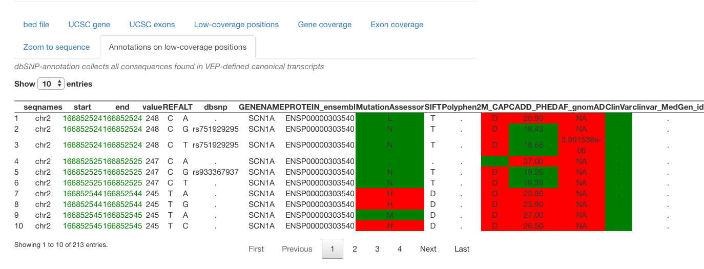

```{r, include = FALSE}
knitr::opts_chunk$set(
  collapse = TRUE,
  comment = "#>"
)
```

# Indroduction


This is a package containing unCOVERApp a shiny application for graphical 
inspection of sequence coverage within gene regions. 

unCOVERApp allows:

- interactive plots displaying sequence gene coverage down to base-pair
resolution and functional and clinical downloadable annotation of base-pair  
positions within user-defined coverage gaps (` Coverage Analysis` page).


- calculation and definition of maximum credible allele frequency (http://cardiodb.org/allelefrequencyapp/) to be used as allele frequency
filtering threshold (` Calculate AF by allele frequency app ` page).

- for somatic variants calculation of binomial probability that position 
coverage is adequate to detect variant allele provided the expected allelic 
fraction and the required number of variant reads (` Binomial distribution`page).


# Installation and example

Install the latest version of `uncoverappLib` using `BiocManager`. 

`uncoverappLib` requires you to have at least R version 3.5. 
The annotation files must be downloaded on 
[Zenodo](https://zenodo.org/record/3747448#.XpBmnVMzbOR) 
and stored in a folder.
Those files must be loaded in users R environment before launching app, as
in following example. 


```{r setup}

#install.packages("BiocManager")
#BiocManager::install("uncoverappLib")
library(uncoverappLib)
```


Alternatively, it can be installed from GitHub using:

```{r}

#library(devtools)
#install_github("Manuelaio/uncoverappLib")
#library(uncoverappLib)
#file.name='../path/sorted.bed.gz'
#tbi='.../path/sorted.bed.gz.tbi'
#run.uncoverapp()

```


After launching the `unCOVERAPP` , click the `Select input file` to start 
analysis or `load example dataset` to show an example dataset. The example 
file is a BED file containg genomic positions of POLG gene. 


# Input file


As input file unCOVERApp takes the following:

- *multisample.bed.gz file* obteined through `make_bed.sh ` scripts.
For more information, see on [github](https://github.com/Manuelaio/unCOVERApp/)

Once uploaded to unCOVERApp, the BED file content can be visualized 
in table ` bed file `.


To assess sequence coverage the following **input parameters** must be specified 
in the sidebar of the **Coverage Analysis** section:


- ` Reference Genome` : reference genome (hg19 or hg38) 

- ` Gene name ` and push ` Apply ` button:  HGNC official gene name 

-  ` Chromosome ` : chromosome number

- ` coverage threshold ` : required coverage threshold  

- ` Sample  ` : sample(s) to analyze according to help text indications on the
App page

- ` Transcript number ` : transcript number as in first column of 
` Exon genomic coordinate positions from UCSC ` output App table.

- ` exon number ` and push ` Make exon ` : to zoom in a specific exon


Other input sections, as ` Transcritp ID `, ` START genomic position `, 
` END genomic position ` and ` Region coordinate `, are dynamically filled. 

# Output

unCOVERApp generates the following **outputs** : 


- unfiltered BED file in` bed file ` and the corresponding filtered dataset in
` Low coverage positions ` 

- information about interest gene(s) in ` UCSC gene ` table

- sequence gene coverage plot in ` Gene coverage `. 
The plot displays chromosome ideogram, genomic location and gene annotations 
from *Ensembl*  and transcripts annotation from *UCSC*. 
Related table shows the number of uncovered position ineach exons given a 
user-defined transcript  number 


- plot of a specific exon, selected by sidebar  ` exon number ` , in 
` Exon coverage `. Related table shows the number of Low coverage positions 
present in ClinVar and with a high impact annotation. 

- dbNSFP annotation of low coverage positions can be found in  
`Annotation on low-coverage positions ` . Users may click on download button and
save the table as spreadsheet format with certain cells colored  following 
thresholds for clinically-relevant variant parameters (gnomAD allele frequency, 
CADD, MAP_CAP, SIFT, Polyphen2, Clinvar, OMIM ID, HGVSp and HGVSc, 
functional impact of a variant score).

In **Calculate maximum credible allele frequency** page, users can set allele 
frequency cut-offs based on assumptions about the genetic architecture of the
disease, if not calculated, variant allele frequency 5% will be used instead 
for filtering.


The last page **Binomial distribution** returns the 95% binomial probability 
distribution of the variant read number on the input genomic position 
(` START genomic position` and ` END genomic position `). 
Users must specify as input the `allele fraction` (the expected fraction of 
variant reads, probability of success) and `Variant reads ` (the minimum number
of variant reads required by the user to support variant calling, 
number of successes). 


# Example 

Using uncoverappLib function ` run.uncoverapp()` unCOVERApp is launched. User 
could clink on `load example dataset` in order to use example of BED file 
contaning POLG genomic positions. The bed file example have a hg19 genome 
reference.
In panel ` bed file` is shown content of file, then user can write in 
` Gene name ` box in order to retrieve chromosome information about gene and 
complete all required input. In particular, users could choose a coverage 
threshold based on experiment type and the sample to analyzing 
(in the example dataset there is only one sample). In addition, user 
could write a `Transcript number` the app  will automaticcaly load a 
`transcript ID`. In following example, users must choose exon 2 and
automatically load a `transcript ID` of POLG. 
In the ` Gene coverage ` panel, users can view the coverage of gene and the
number of uncovered position in each exons given a user-defined transcript 
number. 
A single exon, selected by sidebar  ` exon number ` , could be zoomed in 
` Exon coverage `.


```{r, echo = FALSE, out.width='80%', fig.align='center', fig.cap="Figure 1:                     Example data. Example of uncovered positions annotate with dbNSFP."}
knitr::include_graphics("exon10tab.png")

```


unCOVERApp provides a table with dbNSFP-based annotation of all potential 
nucleotide changes across low-coverage genomic coordinates, downloadable in 
Excel format. In the table `Annotation on low-coverage positions `, 
changes annotated as clinical, high impact or deleterious are highlighted 
to allow instant evaluation of annotations associated with variants that have 
been potentially missed due to low-DoC.

```{r, echo = FALSE, out.width='80%', fig.align='center', fig.cap="Figure 2:                      Example data. Example of uncovered positions annotate with dbNSFP."}


```


Calculator of the maximum credible population AF (Whiffin N et al., 2016) is 
available in `Calculate AF by allele frequency app`. The allele frequency 
threshold can be modified by the user based on assumptions on the genetic 
architecture of the disease to automatically adjust the displayed variants. 

Lastly, uncoverapp include a simple statistical framework to evaluate if DoC is 
adequate to somatic variant detection at each genomic position where the user 
can set the `Allele Fraction` expected for the disease-related variant and the 
number of `variant reads` that the user considers necessary to support variant 
calling. 
Users must be write `START genomic position` and `END genomic position`. 


# Session information

```{r sessionInfo, echo=FALSE}
sessionInfo()

```


